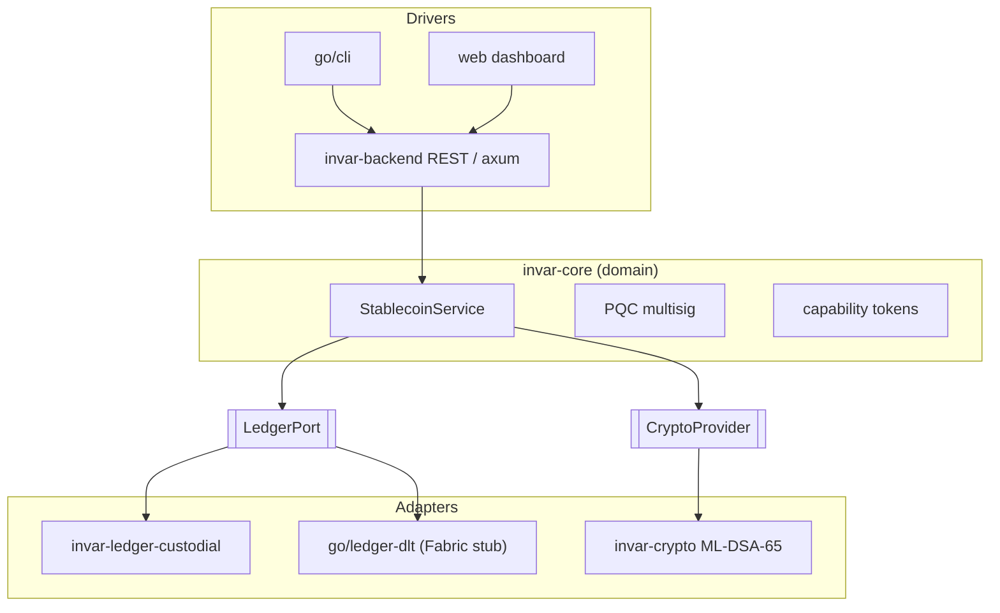

# Invar

[](LICENSE)
[](.github/workflows/ci.yml)
[](docs/FIPS-PQC.md)

A **generic, ledger-agnostic stablecoin framework** with a first-class **post-quantum /
FIPS** cryptography layer. It provides the domain building blocks of a compliant
stablecoin — mint, burn, transfer, redeem, freeze, wipe, pause, KYC/KYB, role-based
access control, supply allowances, holds, rescue, and **proof-of-reserve** — behind clean
ports, so the same core drives a **custodial ledger** today and a **distributed ledger**
later without rewriting business logic.

> **Clean-room by reference.** The module decomposition and compliance operation set were
> informed by the *publicly documented architecture* of Hashgraph's
> [stablecoin-studio](https://github.com/hashgraph/stablecoin-studio) (Apache-2.0). **No
> source was copied.** invar is ledger-agnostic and adds a PQC/FIPS layer with
> no counterpart in the reference. See [`NOTICE`](NOTICE).

## Introduction

Every public-chain stablecoin inherits its signature scheme from a chain you do not
control (secp256k1 on EVM, ed25519/ECDSA on Hedera) — none of which is post-quantum, and
most of which is not a NIST-approved curve. invar inverts that: **you own every
byte of the cryptography**, so the ledger's own signatures and attestations are
**ML-DSA-65 (FIPS 204)** today, with a **FIPS 140-3 validated module** boundary as a
configuration choice (Go crypto module / PKCS#11 HSM) rather than a rewrite.

## Key Features

### Stablecoin Management
- Controlled **mint** (peg- and allowance-gated), **burn**, **transfer**, **redeem**.
- **Holds** (escrow): lock funds, then execute to a beneficiary or release.
- **Token lifecycle**: mutable metadata and irreversible delete/decommission.

### Compliance & Security
- **KYB registration** + **KYC** status; only verified accounts may hold or receive.
- **Role-based access control** (Admin, Minter, Burner, Pauser, Freezer, Wiper,
  ComplianceOfficer, ReserveAttestor, Deleter, SupplyAdmin, Rescuer).
- **Freeze**, **wipe**, **pause**, **rescue** (recover misdirected funds), and per-minter
  **supply allowances**.
- **Capability-token auth**: scoped, TTL-bounded, **ML-DSA-65-signed** grants replace an
  ambient admin identity.

### Post-Quantum Cryptography (FIPS)
- **ML-DSA-65** (FIPS 204) signatures; **ML-KEM-768** (FIPS 203) key establishment.
- **Argon2id** (RFC 9106) key-encryption-key; Argon2id-sealed software keystore.
- Cross-language **golden-vector conformance** for canonical-JSON/HKDF-SHA3/AES-GCM/SHA-384.
- Go components run under the **Go Cryptographic Module (CMVP #5247)** FIPS 140-3 boundary.
- **HTTPS-only, zero-trust** transport; hybrid post-quantum TLS (**`X25519MLKEM768`**) via
  the `pqc-tls` build; the `fips` build uses the CMVP-validated AWS-LC-FIPS provider.

### Multisignature Support
- **M-of-N** approval for privileged operations, with **ML-DSA-65** signatures verified
  over a deterministic canonical preimage — post-quantum multisig, not a classical keyList.

## Monorepo Structure

| Path | Lang | Role |
|---|---|---|
| `crates/invar-core` | Rust | Domain SDK: token ops, ports, roles, compliance, reserve invariant, multisig, capabilities |
| `crates/invar-crypto` | Rust | `CryptoProvider`: ML-DSA-65, Argon2id KEK, sealed keystore, glue |
| `crates/invar-ledger-custodial` | Rust | Custodial double-entry ledger adapter (+ file persistence) |
| `crates/invar-backend` | Rust | axum REST API with capability-token auth |
| `go/crypto` | Go | FIPS/glue crypto + ML-KEM-768 + FIPS-mode check |
| `go/cli` | Go | Operator CLI at parity with the API |
| `go/ledger-dlt` | Go | Hyperledger-Fabric / DLT adapter (stub) |
| `web/` | TS/React | Operator dashboard (Vite) |
| `conformance/` | — | Cross-language golden vectors |
| `docs/` | — | Architecture, FIPS/PQC posture, roadmap |

## Documentation

- [`docs/ARCHITECTURE.md`](docs/ARCHITECTURE.md) — ports & adapters, data flow, crate map.
- [`docs/FIPS-PQC.md`](docs/FIPS-PQC.md) — exact FIPS/PQC posture and boundaries.
- [`docs/DEPLOYMENT.md`](docs/DEPLOYMENT.md) — build variants, config, and the PQC client / proxy header-size caveats.
- [`docs/ROADMAP.md`](docs/ROADMAP.md) — implemented vs planned; the peg guardrail.

## Architecture

Hexagonal (ports & adapters): business rules live in `invar-core` and depend only on
`LedgerPort` (persistence) and `CryptoProvider` (signatures). Everything else is a
replaceable adapter.



**The peg invariant** — `mint` enforces `total_supply + amount ≤ attested_reserve`. Any
funding/lending built on top must move *already-backed* units from a separately
capitalized pool; the core never mints outside a reserve authorization.

**Crypto conformance** — primitives are KAT-locked to NIST FIPS 203/204/180-4/202; the
composition ("glue") is asserted byte-for-byte in **both** Rust and Go against a shared
`conformance/vectors.json`, so an attestation signed on one side verifies on the other.

## Installation & Setup

### Prerequisites
- **Rust** 1.82+ (`rustup`, with `rustfmt` + `clippy`)
- **Go** 1.24+ (for `crypto/mlkem`, `crypto/hkdf`, `crypto/sha3`, `crypto/fips140`)
- **Node** 20.19+/22+ (for the web dashboard)

### Quick setup
```bash
git clone https://github.com/jloasxhq/invar
cd invar
cargo build                 # Rust workspace
(cd go && go build ./...)   # Go module
(cd web && npm ci)          # web dashboard
```

## Development Workflows

### SDK & Backend (Rust)
```bash
cargo run -p invar-backend           # REST API on 127.0.0.1:8080 (dev mode)
INVAR_BIND=0.0.0.0:8080 cargo run -p invar-backend
```

### CLI (Go, FIPS mode)
```bash
cd go
GODEBUG=fips140=on go run ./cli -url http://127.0.0.1:8080 token
```

### Web dashboard
```bash
cd web && npm run dev        # http://localhost:5173
```

## Testing

```bash
cargo test --all                              # Rust
cd go && GODEBUG=fips140=on go test ./...      # Go, under FIPS 140-3 mode
cd web && npm run build                        # web type-check + build
```

### Code Quality Standards
```bash
cargo fmt --all --check
cargo clippy --all-targets -- -D warnings
cd go && go vet ./...
```

## Continuous Integration

[`.github/workflows/ci.yml`](.github/workflows/ci.yml) runs on every push/PR:
**Rust** (fmt + clippy `-D warnings` + test), **Go** (vet + FIPS-mode test), and
**web** (type-check + build). Dependency updates are automated via
[`.github/dependabot.yml`](.github/dependabot.yml).

## Support

Open a [GitHub issue](https://github.com/jloasxhq/invar/issues) for
questions, bugs, or feature requests. For security reports, follow
[`SECURITY.md`](SECURITY.md) (do not open a public issue).

## Contributing

Contributions are welcome — see [`CONTRIBUTING.md`](CONTRIBUTING.md) for the local checks
(which mirror CI) and coding guidelines.

## Code of Conduct

This project adheres to the [Contributor Covenant](CODE_OF_CONDUCT.md). By participating you
are expected to uphold it.

## License

Licensed under the [Apache License, Version 2.0](LICENSE).

## Security

**Not audited. Not a validated FIPS 140-3 module** (the ML-DSA path is algorithm-conformant;
the Go/classical boundary uses the CMVP-validated module). See [`SECURITY.md`](SECURITY.md)
and [`docs/FIPS-PQC.md`](docs/FIPS-PQC.md). Do not use in production without a security review
and legal/regulatory counsel appropriate to your jurisdiction. Remaining hardening (HSM/PKCS#11
custody, DB-backed persistence, Fabric DLT adapter) is tracked in [`docs/ROADMAP.md`](docs/ROADMAP.md).
